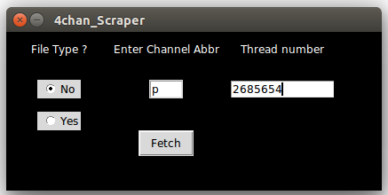

##Python GUI to fetch 4chan thread images

## usage : python 4chan_getimages.py

**Be aware that**

1. Only jpg and png files are downloaded. Other file formats are not supported yet.
2. You need to specify the channel (p, g etc) and the thread id (7 digit integer)
