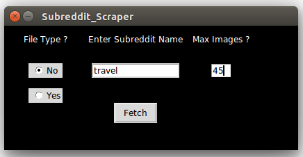

## Python GUI to fetch latest images from a subreddit

## usage : python reddit_getimages.py

**Be aware that**

1. Only images hosted on Imgur can be downloaded
2. Max download limit is 60 images. You have the option to download less.
3. Subreddit name is case sensitive
4. It is highly recommended to download without file extensions hard coded. Set button to yes for downloads with file extensions. However, this may sometimes confuse the image viewer you use.
